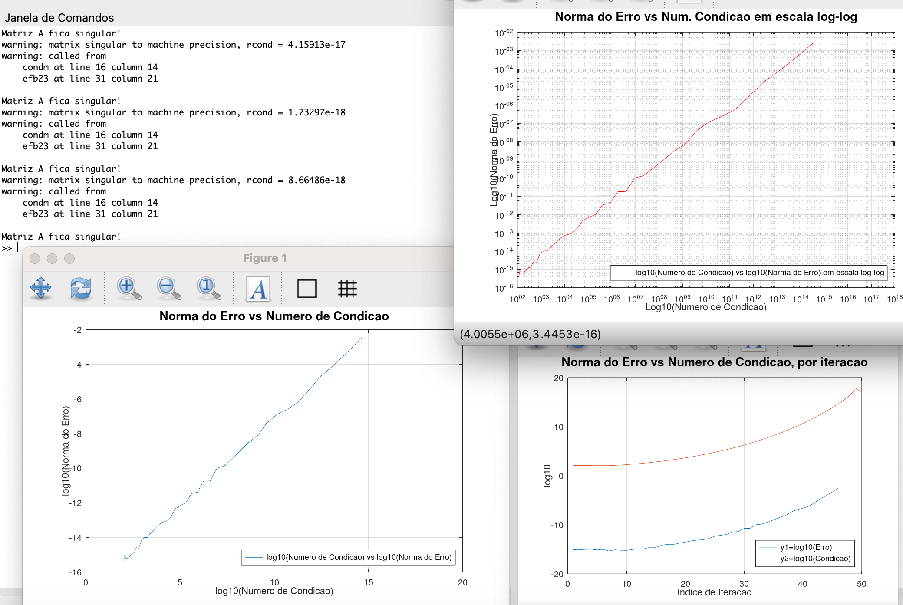

<h1 align="center">
    
</h1>

📌 EfolioB - Computação numerica
----------------------------------

Cálculo do número de condição e no método de eliminação de Gauss com escolha parcial de pivot para resolver sistemas de equações lineares. Este estudo também enfatiza a importância da escolha de pivot na eliminação de Gauss e do número de condição como indicadores críticos da estabilidade e precisão das soluções numéricas. As técnicas numéricas aqui exploradas são fundamentais para entender e resolver eficientemente sistemas de equações lineares, que são problemas recorrentes em várias áreas da ciência e engenharia. Compreender estas técnicas permite prever e controlar erros, otimizar soluções e entender a estabilidade de algoritmos numéricos.

Deve executar o Script efb23.m: Este script realiza um estudo iterativo, alterando progressivamente a matriz A para se aproximar de uma condição singular e analisando o impacto no número de condição e na solução do sistema. O script gera gráficos que ilustram a relação entre o número de condição e a norma do erro da solução. Serve para analisar a relação entre o número de condição de uma matriz e a norma do erro na solução de sistemas lineares. O script realiza uma série de cálculos e gera gráficos para ilustrar essa relação. Abaixo, destaco e explico algumas partes cruciais do código:

🔧 Tecnologias utilizadas:
------------------

- <strong>Octave</strong>
- <strong>MacOS</strong>

💬 Fale comigo
------------------
[*Entre em contato comigo*](https://www.linkedin.com/in/ivo-baptista-3712144/)

